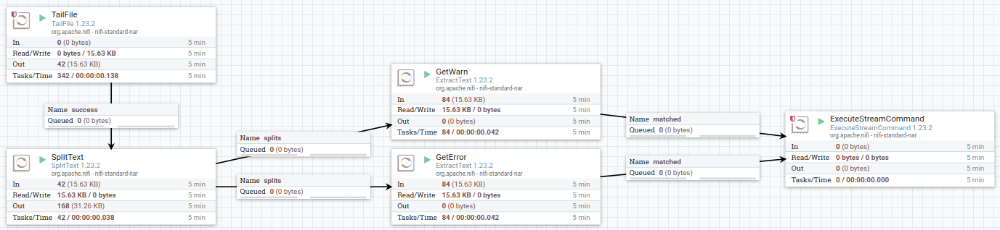
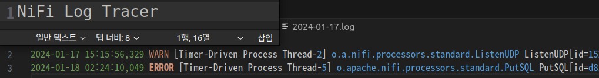
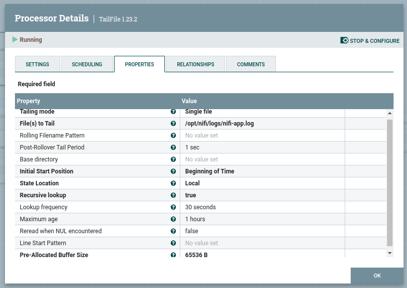
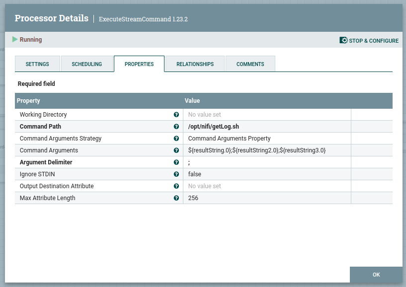

# NiFi Log Tracer

## 기능

> `nifi-app.log`에서 발생하는 모든 `WARN`, `ERROR`로그를 날짜별로 추출

## 흐름

1. 로그 테일링
2. 여러줄 로그일 경우 한줄로 분할
3. `WARN`, `ERROR` 분기
4. 분기된 로그를 실행스크립트를 실행시켜 `YYYY-mm-dd.log`뒤에 추가시킨다.

## 주의

- NiFi의 기본 Log 설정은 `$NIFI_HOME/conf/logback.xml`에 종류별로 정의할 수 있습니다.

- 모든 `ERROR` 그리고 `WARN`을 날짜별로 특정 위치에 저장하기 위한 프로세서이며 가능하면 `$NIFI_HOME/conf/logback.xml`에서 설정하는것을 권장합니다.

- 기본적으로 저장되는 경로는 `$NIFI_HOME/logs/needs_resolution_logs`에 `YYYY-mm-dd.log` 파일로 저장됩니다.

- 여러 개발 테스트를 하는 중에 사용하는것은 권장하지 않고, 유지보수 단계에서 사용하는것을 권장합니다.

- 추출된 로그파일들에 대한 삭제주기가 설정되어 있지 않습니다. 과하게 많은 `WARN`, `ERROR`로그들은 추후에 디스크 공간부족문제의 원인이 될 수 있습니다.

## 스크린샷

1. NiFi Flow
    > 만약 `WARN`추적을 원치 않을 경우 `GetWarn` 프로세서를 삭제하세요.

    

2. 추적된 로그들
    

3. TailFile 설정
    > `nifi-app.log`외 다른 파일을 추적할 경우 참조.

    

4. ExecuteStreamCommand 설정
    > 실행 쉘 파일(`getLog.sh`)파일의 위치를 변경할 경우 참조.

    > `docker`컨테이너일 경우 컨테이너 내부 경로를 기준으로 작성.

    

## 사용법

1. NiFi WEB 에서 `nifiLogTracer.xml`탬플릿을 불러옵니다.

2. 탬플릿을 추가합니다.

3. `TailFile` 설정에서 `nifi-app.log`파일의 경로를 작성합니다.(기본적으로 `$NIFI_HOME/logs` 디렉토리에 위치해 있습니다.)

4. `getLog.sh` 파일을 원하는 디렉토리에 붙여넣습니다.

5. `ExecuteStreamCommand` 설정에서 `getLog.sh`파일의 위치를 작성합니다.

6. 템플릿의 프로세스 그룹을 실행시킵니다.
